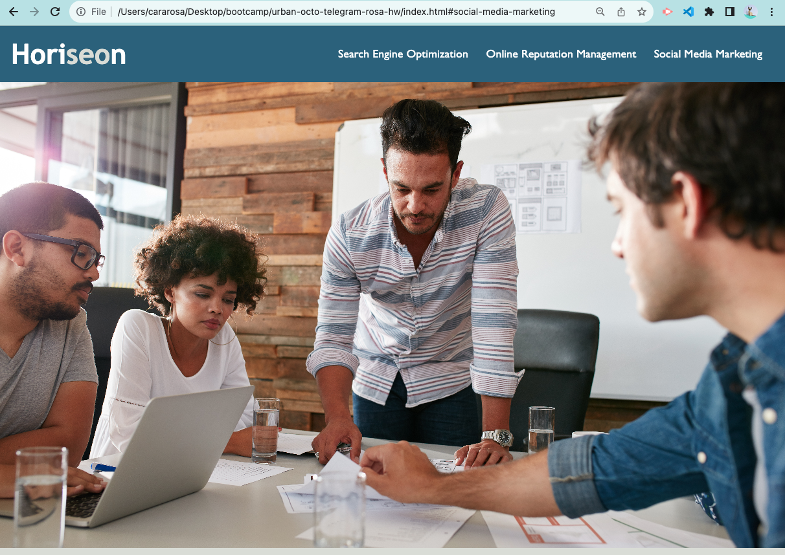
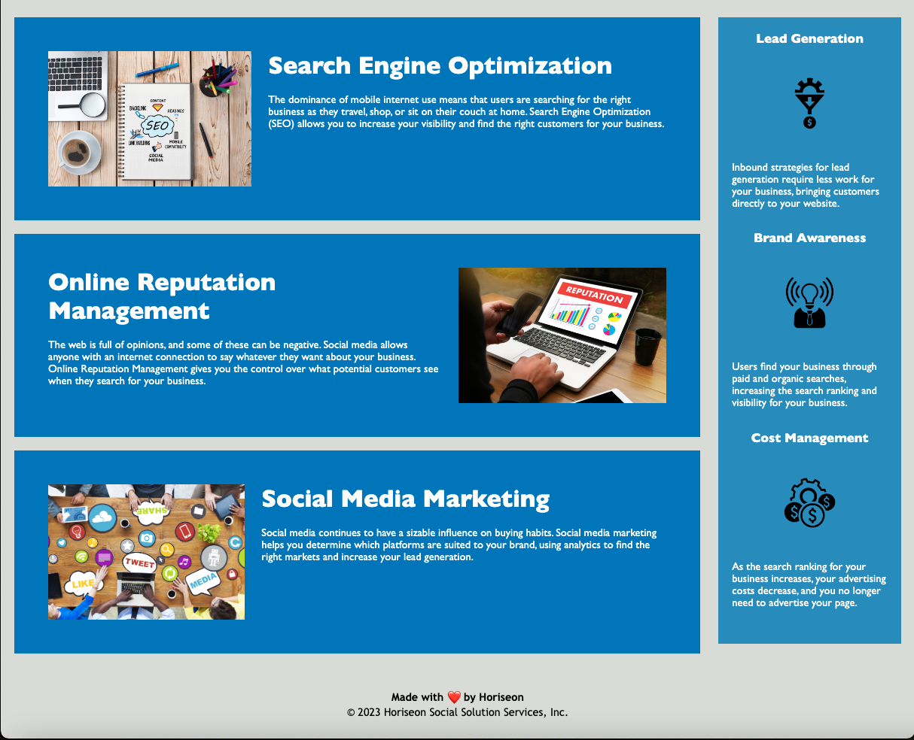

# Horiseon Website & Adding Accessibility

## Description

The Horiseon website can be utilized by users to learn about an efficient online presence for your business. Horiseon targets and specifies three different tools (Search Engine Optimization, Online Reputation Management, and Social Media Marketing) that will boost your business’s visibility and safety. Search Engine Optimization gives businesses the opportunity to become a prime option for relevant customers. Online Reputation Management safeguards businesses’ reputations by filtering certain comments that future users could see. Social Media Marketing targets the best social media platform that businesses should use. Lead generation, brand awareness, and cost management emphasize further the importance of applying these tools to fully enhance your business.

This project focuses on better web accessibility. To improve the accessibility, semantic HTML elements replaced non-semantic elements, organized and consolidated CSS selectors replaced disorganized selectors, comments describe the code in detail, alt text has been added to describe the images.

Improving accessibility allows for a larger number of variable users.

## Installation

No installation necessary. Here is the link to the website: [Deployed application](https://cararosa.github.io/urban-octo-telegram-rosa-hw/)

Below are the screenshots of the webpage shown in my browser:

## License

No license necessary.